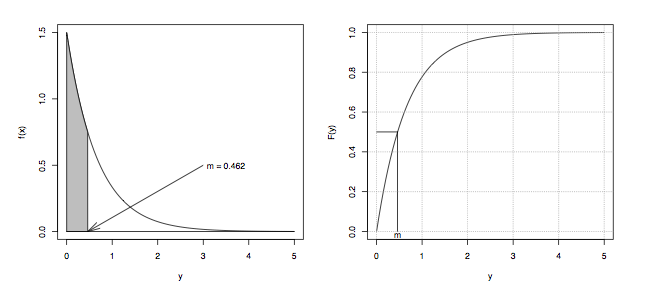

Develop the R code to reproduct the following plots:

1. The exponential probability density function and cumulative distribution function with $\lambda = 1.5$, where $m$ is the median.



```{r, fig.width=9, fig.height=4.5}
par(mfrow=c(1,2), cex=.75)
y <- seq(0, 5, 0.0001)
f.y <- function(y) dexp(y, 1.5)
F.y <- function(y) pexp(y, 1.5)
m <- qexp(.5, 1.5)

plot(y, f.y(y), type="l", ylab="f(y)")
polygon(c(0, y[y<m], m), c(0, f.y(y[y<m]), 0), col="gray")
lines(x=c(0, 5), y=c(0,0))
lines(x=c(0, 0), y=c(0,1.5))
arrows(3, .5, m, 0, .2, 15)
text(3, .5, paste("m =", round(m, 3), ""), pos=4)

plot(y, F.y(y), type="l", ylab="F(y)")
grid()
lines(rep(m, 2), c(0, F.y(m)))
lines(c(0, m), rep(F.y(m), 2))
text(m, 0, "m", pos=1, offset=0.1)
```

2. Histogram of a normal random sample of $n = 100$ with $\mu = 10$ and $\sigma = 2$.


```{r}
par(mfrow=c(1,1), cex=1)
set.seed(4321)
y <- rnorm(n = 100, mean = 10, sd = 2)
mean(y)
sd(y)
hist(y, prob=T, breaks=seq(2, 18, 2), axes=F, xlim=c(2, 18))
axis(side=1, at=seq(2, 18, 2))
axis(side=2)
lines(seq(2, 18, .0001), dnorm(seq(2, 18, .0001), 10, 2))
rug(y)
```

3. Cross-section of a mine tunnel. The small dots at the bottom of the mine tunnel represent debris which is uniformly distribured from 0 to 360 with $n = 250$.


```{r, fig.height=4, fig.width=8}
par(cex=1.25)
x <- runif(250, 0, 360)
y <- sapply(abs(rnorm(250,,.5)), function(i) min(i, rnorm(1, 1, .2)))
plot(x, y, xlim=c(-40, 400), ylim=c(0, 12), axes=F, xlab="", ylab="",
     pch=20, cex=0.3)
axis(side=1, at=c(0, 360), line=-.2, lwd=3, font=2)
abline(h=-.1, lwd=3)
abline(h=5, lwd=3)
lines(c(-10, 10), rep(5, 2), col="white", lwd=4)
lines(c(350, 370), rep(5, 2), col="white", lwd=4)
lines(c(-10, -10), c(5, 10), lwd=2)
lines(c(10, 10), c(5, 10), lwd=2)
lines(c(350, 350), c(5, 10), lwd=2)
lines(c(370, 370), c(5, 10), lwd=2)
text(180, 5, "Roof", pos=3, lwd=2, font=2)
text(180, 12, "Air Shafts", lwd=2, font=2)
arrows(225, 12, 345, 10, length=.1, angle=10, lwd=2)
arrows(125, 12, 15, 10, length=.1, angle=10, lwd=2)
```
