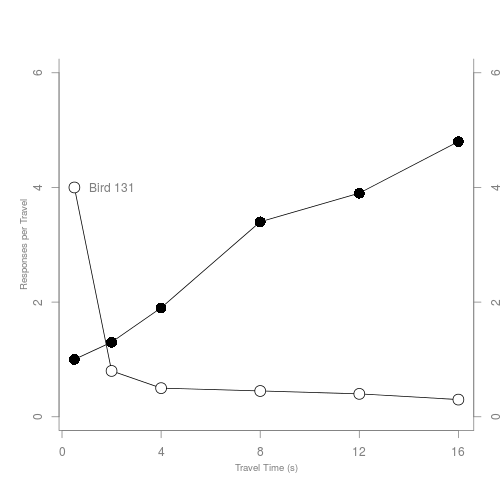
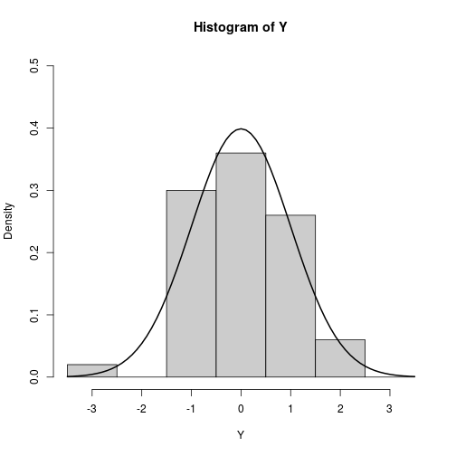
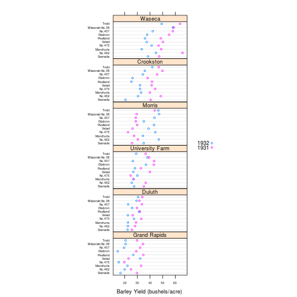

A simple plot in r:

```r
head(pressure)
```

```
##   temperature pressure
## 1           0   0.0002
## 2          20   0.0012
## 3          40   0.0060
## 4          60   0.0300
## 5          80   0.0900
## 6         100   0.2700
```

```r
plot(pressure)
text(150, 600, 
     "Pressure (mm Hg)\nversus\nTemperature (Celsius)")
```

 

Note that `plot` creates the graph, whereas `text` superimposes text.

## 10.1 R graphics examples

The plots in the book and the code can be found at the book web site:
[R Graphics Second Edition](https://www.stat.auckland.ac.nz/~paul/RG2e/)

### 10.1.1 Standard plots

R provides the usual range of standard statistical plots, including scatterplots, boxplots, histograms, barplots, pie charts, etc. Basic plot types can be produced by a single function call, e.g., `pie(pie.sales)` will produce a pie chart. But plots can also be considered merely as starting points for producing more complex images.


```r
# Scatterplot
x <- c(0.5, 2, 4, 8, 12, 16)
y1 <- c(1, 1.3, 1.9, 3.4, 3.9, 4.8)
y2 <- c(4, .8, .5, .45, .4, .3)
# par(las=1, mar=c(4, 4, 2, 4), cex=.7)
plot.new()
plot.window(range(x), c(0, 6))
lines(x, y1)
lines(x, y2)
points(x, y1, pch=16, cex=2)
points(x, y2, pch=21, bg="white", cex=2)
par(col="gray50", fg="gray50", col.axis="gray50")
axis(1, at=seq(0, 16, 4))
axis(2, at=seq(0, 6, 2))
axis(4, at=seq(0, 6, 2))
box(bty="u")
mtext("Travel Time (s)", side=1, line=2, cex=0.8)
mtext("Responses per Travel", side=2, line=2, las=0, cex=0.8)
mtext("Responses per Second", side=4, line=2, las=0, cex=0.8)
text(2, 4, "Bird 131")
```

 

```r
# par(mar=c(5.1, 4.1, 4.1, 2.1), col="black", fg="black", col.axis="black")
```

Notice the axes have been customized and a label added.

The ability to add several graphical elements together to create the final result is a fundamental feature of R graphics. 

Now we show how a normal curveis superimposed over a historgram for random data.

```r
Y <- rnorm(50)
# Make sure no Y exceed [-3.5, 3.5]
Y[Y < -3.5 | Y > 3.5] <- NA
x <- seq(-3.5, 3.5, .1)
dn <- dnorm(x)
# par(mar=c(4.5, 4.1, 3.1, 0))
hist(Y, breaks=seq(-3.5, 3.5), ylim=c(0, 0.5), 
     col="gray80", freq=FALSE)
lines(x, dnorm(x), lwd=2)
```

 

```r
# par(mar=c(5.1, 4.1, 4.1, 2.1))
```

### 1.1.2 Trellis plots

A simple trellis plot from the `lattice` package:

```r
library(lattice)

trellis.par.set(list(fontsize=list(text=6),
               par.xlab.text=list(cex=1.5),
                     add.text=list(cex=1.5),
                     superpose.symbol=list(cex=.5)))
key <- simpleKey(levels(barley$year), space = "right")
key$text$cex <- 1.5
     dotplot(variety ~ yield | site, data = barley, groups = year,
             key = key,
             xlab = "Barley Yield (bushels/acre) ",
             aspect=0.5, layout = c(1,6), ylab=NULL)
```

 
The data are yields of several different varieties of barley at six sites, over two years.

Notice the *multipanel conditioning* which creates multiple plots by splitting the data.

### 1.1.3 The grammar of graphics

Leland Wilkinson’s Grammar of Graphics provides another completely different paradigm for producing very flexible and general statistical plots.

Hadley Wickham's **ggplot2** builds on the grammar of graphics (gg) to create a very wide variety of plots from a relatively small set of fundamental components. It has a feature called facetting, which is similar to lattice’s multipanel plots.

Here is a simple example:

```r
library(ggplot2)
```

```
## Error in library(ggplot2): there is no package called 'ggplot2'
```

```r
ggplot(data=mpg, aes(x=displ, y=hwy, shape=factor(cyl))) + 
    geom_point() +
    stat_smooth(method="lm", colour="black") +
    scale_shape_manual(values=c(1, 16, 3, 17)) + 
    theme_bw() 
```

```
## Error in eval(expr, envir, enclos): could not find function "ggplot"
```

### 1.1.4 Specialized plots

R provides a set of functions for producing graphical output primitives, such as lines, text, rectangles, and polygons. Thus, users can create specialized plots, e.g., maps. There are various add-on packages for this: **maps**, **mapdata**, and **mapprog**.

Here is NZ:

```r
library(maps)
```

```
## Error in library(maps): there is no package called 'maps'
```

```r
library(mapdata)
```

```
## Error in library(mapdata): there is no package called 'mapdata'
```

```r
par(mar=rep(1, 4))
map("nzHires", fill=TRUE, col="gray80",
    regions=c("North Island", "South Island", "Stewart Island"))
```

```
## Error in eval(expr, envir, enclos): could not find function "map"
```

```r
points(174.75, -36.87, pch=16, cex=2,
       col=rgb(0,0,0,.5))
```

```
## Error in plot.xy(xy.coords(x, y), type = type, ...): plot.new has not been called yet
```

```r
arrows(172, -36.87, 174, -36.87, lwd=3)
```

```
## Error in arrows(172, -36.87, 174, -36.87, lwd = 3): plot.new has not been called yet
```

```r
text(172, -36.87, "Auckland  ", adj=1, cex=2)
```

```
## Error in text.default(172, -36.87, "Auckland  ", adj = 1, cex = 2): plot.new has not been called yet
```

```r
# mini world map as guide
maplocs <- map(projection="sp_mercator", wrap=TRUE, lwd=0.1, 
               col="gray", ylim=c(-60, 75),
               interior=FALSE, orientation=c(90, 180, 0), add=TRUE,
               plot=FALSE)
```

```
## Error in eval(expr, envir, enclos): could not find function "map"
```

```r
xrange <- range(maplocs$x, na.rm=TRUE)
```

```
## Error in eval(expr, envir, enclos): object 'maplocs' not found
```

```r
yrange <- range(maplocs$y, na.rm=TRUE)
```

```
## Error in eval(expr, envir, enclos): object 'maplocs' not found
```

```r
aspect <- abs(diff(yrange))/abs(diff(xrange))
```

```
## Error in diff(yrange): object 'yrange' not found
```

```r
# customised to 6.5 by 4.5 figure size
par(fig=c(0.99 - 0.5, 0.99, 0.01, 0.01 + 0.5*aspect*4.5/6.5), 
    mar=rep(0, 4), new=TRUE)
```

```
## Error in par(fig = c(0.99 - 0.5, 0.99, 0.01, 0.01 + 0.5 * aspect * 4.5/6.5), : object 'aspect' not found
```

```r
plot.new()
plot.window(xlim=xrange,
            ylim=yrange)
```

```
## Error in plot.window(xlim = xrange, ylim = yrange): object 'xrange' not found
```

```r
map(projection="sp_mercator", wrap=TRUE, lwd=0.5, ylim=c(-60, 75),
    interior=FALSE, orientation=c(90, 180, 0), add=TRUE)
```

```
## Error in eval(expr, envir, enclos): could not find function "map"
```

```r
symbols(-.13, -0.8, circles=1, inches=0.1, add=TRUE)
box()
```

A financial chart:

```r
library(quantmod)
```

```
## Error in library(quantmod): there is no package called 'quantmod'
```

```r
getSymbols("YHOO")
```

```
## Error in eval(expr, envir, enclos): could not find function "getSymbols"
```

```r
chartSeries(YHOO, subset='last 4 months'
 )
```

```
## Error in eval(expr, envir, enclos): could not find function "chartSeries"
```

Specialized plots can be made from both the traditional graphics functions (Chap 3) and the **grid** package (Chaps 6 and 7).

### 1.1.5 General graphics scenes

We can do tabular arrangements of data as a plot (Fig 1.10) 

## 1.2 The Organization of R graphics

Fundamental to R graphics is the package **grGraphics** called the *graphics engine*. R's two graphics systems build on top of the engine: **graphics** (traditional) and **grid**.

Other packages build on top of these two base packages. See Figure 1.14.

### 1.2.1 Types of graphics functions

Graphics functions can be broken down into two main types:  
* high-level: produce complete plots;  
* low-level: add further output to a plot.

### 1.2.2 Traditional graphics versus grid graphics

It may be quicker to get going with traditional graphics, but both **lattice** and **ggplot2** offer more efficient and sophisticated options. However, both **lattice** and **ggplot2** have a somewhat steep learning curve. At a lower level **grid** is richer than **graphics**.

