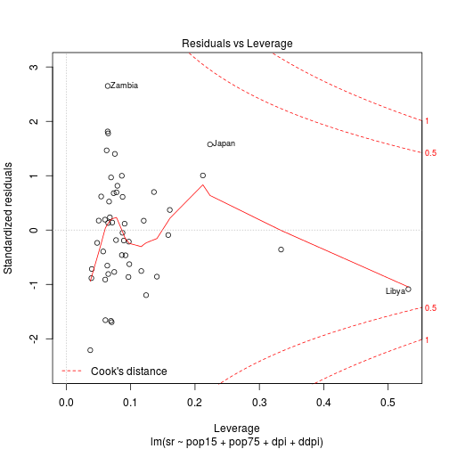

This chapter introduces the main high-level plotting functions in the
traditional graphics system. These are the functions used to produce
complete plots such as scatterplots, histograms, and boxplots. The
graphics functions that make up the traditional graphics system are
provided in an extension package called **graphics**, which is
automatically loaded in a standard installation of R. 

The package can be loaded by:

```r
library(graphics)
```
but this is done automatically in standard installations.

This chapter mentions many of the high-level graphics functions in the
graphics package, but does not describe all possible uses of these
functions. For detailed information on the behavior of individual
functions consult the individual help pages. 

```r
help(barplot)
# example(barplot)
```

## 2.1 The traditional graphics model

A plot is created in traditional graphics by calling a high-level
function that creates a complete plot, then calling low-level
functions to add more output if necessary. 

## 2.2 The plot() function

The most important high-level function in traditional graphics is the
`plot()` function. This provides the simplest way to produce a
complete plot in R. The first argument to `plot()` provides the data
to plot. 

There is a reasonable amount of flexibility in the way that the data
can be specified. The following are equivalent: 

```r
head(pressure)
```

```
##   temperature pressure
## 1           0   0.0002
## 2          20   0.0012
## 3          40   0.0060
## 4          60   0.0300
## 5          80   0.0900
## 6         100   0.2700
```

```r
plot(pressure)
```

 

```r
# plot(pressure$temperature, pressure$pressure)
# plot(pressure ~ temperature, data=pressure)
```

There are variations in the scatterplot controlled by the **type** argument.

```r
y <- rnorm(20)
plot(y, type="p")
```

 

```r
plot(y, type="l")
```

 

```r
plot(y, type="b")
```

 

```r
plot(y, type="h")
```

 

Traditional graphics also does not make a distinction between a plot
of a single set of data and a plot containing multiple series of
data. Additional data series can be added to a plot using low-level
functions such as `points()` and `lines()`. 

The `plot()` function is *generic*. The `plot()` function can cope
with the same data being specified in several different
formats. However, being generic also means that if `plot()` is given
different types of data, it will produce different types of plots. For
example, the `plot()` function will produce a boxplot, rather than a
scatterplot, if the $x$ variable is a factor, rather than a numeric
vector. 

What happens if `plot()` is applied to an `lm` R object?

```r
# help(plot.lm)
lmfit <- lm(sr ~ pop15 + pop75 + dpi + ddpi, data = LifeCycleSavings)
plot(lmfit)
```

    

The `cluster` package provides a `plot()` method for plotting the
result of an agglomerative hierarchical clustering procedure (an
`agnes` object). This method produces a special bannerplot and a
dendrogram from the data. 

```r
library(cluster)
subset <- sample(1:150, 20)
cS <- as.character(Sp <- iris$Species[subset])
cS[Sp == "setosa"] <- "s"
cS[Sp == "versicolor"] <- "v"
cS[Sp == "virginica"] <- "g"
ai <- agnes(iris[subset, 1:4])
plot(ai, labels = cS)
```

  

The following sections briefly describe the main types of plots that
can be produced using either `plot()` or one of the other high-level
functions in the `graphics` package. 


