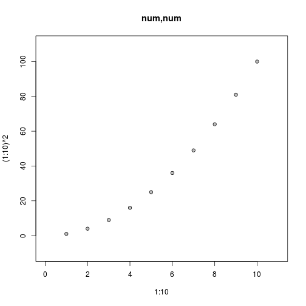

## 2.3 Plots of a single variable

The `plot()` function will accept a:  
* single numeric vector  

> A numeric vector will produce a scatterplot of the numeric values as a function of their indices.

* a factor  

> A factor produces a barplot of the counts for each level of the factor.

* one-dimensional table

> A table of counts produces a barplot of the counts for each level of the factor.

The `plot()` function will also accept a formula of the form `~x` and if the variable `x` is numeric, the result is a one-dimensional scatterplot (stripchart). If `x` is a factor, the result is a barplot.

A barplot can be produced explicitly with the `barplot()`
function. The difference is that this function requires a numeric
vector, rather than a factor, as input and the numeric values are
treated as the heights of the bars to be plotted. 

One issue with producing a barplot is providing a meaningful label below each bar. The `plot()` function uses the levels of the factor being plotted for bar labels and `barplot()` will use the names attribute of the numeric vector if it is available.
As alternatives to a barplot, the `pie()` function plots the values in
a numeric vector as a pie chart, and `dotchart()` produces a dotplot. 

A simple index plot:

```r
plot((1:10)^2, main="Index Plat", xlim=c(0, 11), ylim=c(-10, 110))
```

 

A table plot:

```r
rep(1:3, 1:3)
```

```
## [1] 1 2 2 3 3 3
```

```r
table(rep(1:3, 1:3))
```

```
## 
## 1 2 3 
## 1 2 3
```

```r
plot(table(rep(1:3, 1:3)), main="Table Plot", lwd=2, xlim=c(0, 4), ylim=c(0, 4))
```

 

A barplot:

```r
barplot(table(rep(1:3, 1:3)), main="Barplot", xlim=c(-1, 5), ylim=c(0, 4))
```

 

A pie chart:

```r
pie(c(1, 2, 4), main="Pie Chart", col=gray(1:3/4), cex=.7, labels=c("1", "2", "4"), axes=NULL)
```

 

A dotplot:

```r
dotchart(1:3, main="Dotplot", pch=21, bg="gray", lcolor="black", xlim=c(0, 4))
```

 

A boxplot:

```r
boxplot((1:10)^2, main="Boxplot", col="gray", ylim=c(-10, 110))
```

 

A histogram:

```r
hist((1:100)^2, main="hist", col="gray", breaks=6,
     xlim=c(-1000, 11000), ylim=c(0, 50))
```

 

A stripchart:

```r
stripchart((1:10)^2, main="Stripchart", method="stack", cex=1,
           xlim=c(-10, 110), ylim=c(-1, 3), pch=21, bg="gray")
```

 

A stem-and-leaf plot:

```r
stem(1:20)
```

```
## 
##   The decimal point is 1 digit(s) to the right of the |
## 
##   0 | 1234
##   0 | 56789
##   1 | 01234
##   1 | 56789
##   2 | 0
```

## 2.4 Plots of two variables

The `plot()` function will accept two variables in a variety of formats:  
* a pair of numeric vectors;  
* one numeric vector and one factor;  
* two factors;  
* a list of two vectors or factors (named `x` and `y`);  
* a two-dimensional table;  
* a matrix or data frame with two columns (the first column is treated as x);  
* a formula of the form `y ~ x`.  

If both variables are numeric, the result is a scatterplot. If `x` is
a factor and `y` is numeric, the result is a boxplot for each level of
`x`. If `x` is numeric and `y` is a factor, the result is a (grouped)
stripchart, and if both variables are factors, the result is a
spineplot. If `plot()` is given a table of counts, the result is a
mosaic plot. 

A scatterplot:

```r
plot(1:10, (1:10)^2, main="num,num", pch=21, bg="gray", 
        xlim=c(0, 11), ylim=c(-10, 110))
```

 

A smoothed scatterplot:

```r
x <- rnorm(10000)
smoothScatter(x, x + rnorm(10000)/3,  main="Smoothed Scatterplot",
        nbin=64, colramp=function(n) { gray(n:1/(n + 1)) },
        xlim=c(-5, 5), ylim=c(-5, 5))
```

 

Boxplots:

```r
boxplot(list((1:10)^2, 120 - (1:10)^2), main="Side-by-Side Boxplot", col="gray",
        boxwex=0.5, ylim=c(-10, 130))
```

 

Stacked barplot:

```r
barplot(rbind(1:3, (1:3)^2), main="Stacked Barplot", xlim=c(0, 4), ylim=c(0, 13))
```

 

Side-by-side barplot:

```r
barplot(rbind(1:3, (1:3)^2), main="Side-by-Side Barplot", beside=TRUE,
        xlim=c(0, 10), ylim=c(0, 11))
```

 

Stripchart:

```r
stripchart(list((1:10)^2, 140 - (1:10)^2), main="Stripchart",
        xlim=c(-10, 150), ylim=c(0, 3), pch=21, bg="gray", cex=1)
```

 

A spineplot:

```r
spineplot(rep(1:3, each=6), factor(c(rep(1:3, 3:1), rep(1:3, 2), rep(1:3, 1:3))),
        main="Spineplot", sub="num,fac")
```

 

Mosaic plot:

```r
mosaicplot(table(factor(rep(1:3, each=6)),
                 factor(c(rep(1:3, 3:1), rep(1:3, 2), rep(1:3, 1:3)))),
           main="Mosaic Plot", off=10, cex.axis=.1, box=FALSE)
```

```
## Warning in mosaicplot.default(table(factor(rep(1:3, each = 6)),
## factor(c(rep(1:3, : extra argument 'box' will be disregarded
```

 

## 2.5 Plots of many variables

Given a data frame, with all columns numeric, the `plot()` function will produce a scatterplot matrix, plotting all pairs of variables against each other.

The `pairs()` function does likewise, but it will accept the data in matrix form as well.

An alternative, when the data are in matrix form, is the `matplot()` function, which will plot a single scatterplot with a separate series of data symbols or lines for each column of data. The data can be separate x and y matrices, or a single matrix, in which case the values are treated as y-values and plotted against 1:nrow.


```r
plot(iris[-5], log = "xy")
```

 


```r
pairs(iris[-5], log = "xy")
```

 

A matplot:

```r
mdf <- cbind(3:6, (3:6)^2, (3:6)^3)
names(mdf) <- c("Y1", "Y2", "Y3")
matplot(mdf[order(mdf[, 1]), ], main="matplot",  pch=21:23, bg=c("white", "black", "gray"),
        type="o", col="black", xlim=c(0, 6), ylim=c(-10, 230))
```

 

Image:

```r
aaa <- seq(0, pi, length=10)
xxx <- rep(aaa, 10)
yyy <- rep(aaa, each=10)
zzz <- sin(xxx) + sin(yyy)
image(matrix(zzz, ncol=10), main="Image", col=gray(1:12/13))
```

 

Contour plot:

```r
contour(matrix(zzz, ncol=10), main="contour", levels=seq(0, 2, .25), labcex=.4)
```

 

Perspective plot:

```r
persp(matrix(zzz, ncol=10), main="Perspective Plot", theta=30, phi=45, col="gray")
```

 

Symbol plot:

```r
symbols(xxx, yyy, main="Symbols", circles=zzz, inches=.03)
```

 

Mosaic plot:

```r
mosaicplot(table(factor(rep(1:3, each=6)), 
              factor(c(rep(1:3, 3:1), rep(1:3, 2), rep(1:3, 1:3)))),
        main="Mosaic Plot", cex.axis=.1, off=10)
```

 

## 2.6 Arguments to graphics functions


```r
par(mfrow=c(2, 2), mar=c(2.5, 2, 1, 1), cex=0.6)
boxplot(decrease ~ treatment, data = OrchardSprays,
        log = "y", col="light gray")
boxplot(decrease ~ treatment, data = OrchardSprays,
        log = "y", col="light gray", 
        boxwex=0.5)

par(las=2, xpd=NA)
barplot(VADeaths[1:2,], angle = c(45, 135), 
        density = 20, col = "gray",
        names=c("RM", "RF", "UM", "UF"))
barplot(VADeaths[1:2,], angle = c(45, 135), 
        density = 20, col = "gray",
        names=c("RM", "RF", "UM", "UF"),
        horiz=TRUE)
```

 

### 2.6.1 Standard arguments to graphics functions

Despite the existence of many arguments that are specific only to a single graphics function, there are several arguments that are “standard” in the sense that many high-level traditional graphics functions will accept them.

Most high-level functions will accept graphical parameters that control such things as color (`col`), line type (`lty`), and text font (`font` and `family`). Section 3.2 provides a full list of these arguments and describes their effects.

It is usually possible to modify the range of the axis scales on a plot by specifying `xlim` or `ylim` arguments in the call to the high-level function, and often there is a set of arguments for specifying the labels on a plot: `main` for a title, `sub` for a subtitle, `xlab` for an x-axis label and `ylab` for a y-axis label.


```r
y <- rnorm(20)
plot(y, type="l", lwd=3)
```

 

```r
plot(y, type="l", col="gray")
```

 

```r
plot(y, type="l", lty="dashed")
```

 

```r
plot(y, type="l", ylim=c(-4, 4))
```

 

## 2.7 Specialized plots


```r
plot(function(x) { sin(x)/x}, from=-10*pi, to=10*pi, xlab="", ylab="", n=500)
```

 

```r
curve(sin(x)/x, -10*pi, 10*pi)
```

 


